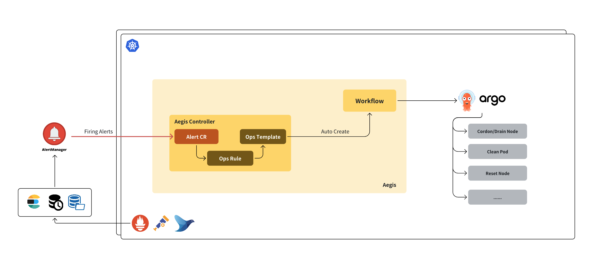

# Aegis - Cloud-Native AIOps Framework for Kubernetes

**Aegis** is an event-driven, cloud-native automated operations system running on Kubernetes. It is designed to automatically respond to and handle various abnormal states in the cluster. By connecting alerts to standardized operations (SOPs), it significantly improves operational efficiency and failure response speed. Through the integration of custom resources (CRDs) and workflow engines (e.g., Argo Workflows), Aegis forms a complete closed-loop from alert reception, rule matching, automatic template rendering, workflow execution, to status feedback. Additional features include AI-HPC cluster diagnostics and periodic node health checks.



# Table of Contents
- [Core Capabilities](#core-capabilities)
  - [Automated Cluster Operations](#automated-cluster-operations)
  - [Cluster Diagnosis (Experimental)](#cluster-diagnosis-experimental)
  - [Cluster Health Checks (Experimental)](#cluster-health-checks-experimental)
- [Build and Deploy](#build-and-deploy)
  - [Build Image](#build-image)
  - [Deploy Aegis Services](#deploy-aegis-services)
- [Alert Source Integration](#alert-source-integration)
  - [Alertmanager](#alertmanager)
  - [Custom Alert Format](#custom-alert-format)
- [Install Ops Rules](#install-ops-rules)
  - [Example: Cordon a node when a `NodeHasEmergencyEvent` alert is triggered.](#example-cordon-a-node-when-a-nodehasemergencyevent-alert-is-triggered)
    - [Define SOP](#define-sop)
    - [Define Ops Rule](#define-ops-rule)
    - [Deploy Rule](#deploy-rule)
- [Trigger Automated Ops](#trigger-automated-ops)
- [Typical Scenario Examples](#typical-scenario-examples)

# Core Capabilities

## Automated Cluster Operations

Aegis defines several Kubernetes CRDs:

* **AegisAlert**: Represents alert resources, including alert type, status, and affected objects.
* **AegisAlertOpsRule**: Defines rules for alert-triggered workflows. On one hand, it specifies matching conditions for `AegisAlert` resources based on type, status, and labels. On the other hand, it references `AegisOpsTemplate`.
* **AegisOpsTemplate**: Contains Argo Workflow templates for automated operations.

Aegis supports converting alert messages from sources (now support for the different alert source parsed by AI, such as AlertManager, Datadog, Zabbix and so on) into `AegisAlert` resources. These alerts are matched against `AegisAlertOpsRule`, which then triggers the rendering and execution of an `AegisOpsTemplate`.

* **Unified alert access**: Supports alerts from AlertManager and a default custom format via webhook.
* **Event-driven response**: Alerts are converted into `AegisAlert` objects to drive workflows.
* **Automated execution**: Integrates with Argo Workflows to execute complex operational tasks.
* **Custom rules and scripts**: Managed via AegisCli to define rules, generate templates, and build images.
* **Full lifecycle tracking**: Every alert’s processing progress can be tracked via CRD status fields.

## Cluster Diagnosis (Experimental)

Defines diagnostic objects through the `AegisDiagnosis` CRD, supporting LLM-based summary diagnosis. Currently supported types:

* [Node](docs/node-diagnosis.md)
* [Pod](docs/pod-diagnosis.md)

Planned support for:

* Argo Workflow
* PytorchJob

## Cluster Health Checks (Experimental)

Supports standardized node and cluster inspection via `AegisNodeHealthCheck` and `AegisClusterHealthCheck` CRDs. Custom inspection scripts can be defined and executed from the Pod perspective for enhanced inspection flexibility.

> **Note:** Compared to [node-problem-detector (NPD)](https://github.com/kubernetes/node-problem-detector), Aegis supports inspections from within pods—useful in AI/HPC scenarios where simulated production environments are required.

---

# Build and Deploy

## Build Image

```bash
docker build -t aegis:test -f Dockerfile .
```

## Deploy Aegis Services

```bash
# Install CRDs
kubectl apply -f manifest/install/

# Deploy Aegis Controller
kubectl apply -f manifest/deploy/ -n monitoring
```

# Alert Source Integration

<!-- Currently supports two alert formats: -->

Support three apis for alert message parse

* `/ai/alert`: [**AIAlertParser**](docs/ai-alert-parse.md), uses LLM to parse various alert messages into the unified Aegis format.
* `/alertmanager/alert`: **Alertmanager** HTTP POST format.
* `/alert`: **Custom JSON format** for external system integrations.

## Alertmanager

According to [Alertmanager documentation](https://prometheus.io/docs/alerting/latest/alertmanager/), the following config sends all alerts to Aegis:

```yaml
global:
  resolve_timeout: 5m
inhibit_rules:
- equal:
    - alertname
  source_matchers:
    - severity = critical
  target_matchers:
    - severity =~ warning
receivers:
- name: Aegis
  webhook_configs:
    - url: http://aegis.monitoring:8080/alertmanager/alert
route:
  group_by: [alertname]
  group_interval: 5m
  group_wait: 0s
  receiver: Aegis
  repeat_interval: 12h
```

## Custom Alert Format

Custom JSON structure in Go:

```go
type Alert struct {
	AlertSourceType AlertSourceType
	Type            string              `json:"type"`
	Status          string              `json:"status"`
	InvolvedObject  AlertInvolvedObject `json:"involvedObject"`
	Details         map[string]string   `json:"details"`
	FingerPrint     string              `json:"fingerprint"`
}

type AlertInvolvedObject struct {
	Kind      string `json:"kind"`
	Name      string `json:"name"`
	Namespace string `json:"namespace"`
	Node      string `json:"node"`
}
```

Send alerts via curl:

```bash
curl http://aegis.monitoring:8080/default/alert -d '{
    "type": "NodeOutOfDiskSpace",
    "status": "Firing",
    "involvedObject": {
        "Kind": "Node",
        "Name": "node1"
    },
    "details": {
        "startAt": "2022021122",
        "node": "node1"
    },
    "fingerprint": "5f972974ccf1ee9b"
}'
```

# Install Ops Rules

### Example: Cordon a node when a `NodeHasEmergencyEvent` alert is triggered.

## Define SOP

The basic shell script:

```bash
kubectl cordon $node
```

## Define Ops Rule

Link the `NodeHasEmergencyEvent` alert to the SOP using a templated workflow (`{{.node}}` will be dynamically rendered based on the alert):

```yaml
---
apiVersion: aegis.io/v1alpha1
kind: AegisAlertOpsRule
metadata:
  name: nodehasemergencyevent
spec:
  alertConditions:
  - type: NodeHasEmergencyEvent
    status: Firing
  opsTemplate:
    kind: AegisOpsTemplate
    apiVersion: aegis.io/v1alpha1
    namespace: monitoring
    name: nodehasemergencyevent
---
apiVersion: aegis.io/v1alpha1
kind: AegisOpsTemplate
metadata:
  name: nodehasemergencyevent
spec:
  manifest: |
    apiVersion: argoproj.io/v1alpha1
    kind: Workflow
    spec:
      serviceAccountName: aegis-workflow
      ttlSecondsAfterFinished: 60
      entrypoint: start
      templates:
      - name: start
        retryStrategy:
          limit: 1
        container:
          image: bitnami/kubectl:latest
          command:
          - /bin/bash
          - -c
          - |
            kubectl cordon {{.node}}
```

## Deploy Rule

```bash
kubectl apply -f rule.yaml
```

Check resources:

```bash
kubectl get aegisalertopsrule
kubectl get aegisopstemplate
```

# Trigger Automated Ops

Send a test alert to Aegis to trigger the workflow:

```bash
curl -X POST http://127.0.0.1:8080/default/alert -d '{
    "type": "NodeHasEmergencyEvent",
    "status": "Firing",
    "involvedObject": {
        "Kind": "Node",
        "Name": "dev1"
    },
    "details": {
        "startAt": "2022021122",
        "node": "dev1"
    },
    "fingerprint": "5f972974ccf1ee9b"
}'
```

Watch the alert lifecycle:

``` bash
$ kubectl -n monitoring get aegisalert --watch | grep default
default-nodehasemergencyevent-9njt4                NodeHasEmergencyEvent           Node         dev1     Firing     1                                   
default-nodehasemergencyevent-9njt4                NodeHasEmergencyEvent           Node         dev1     Firing     1       Triggered       Pending     0s
default-nodehasemergencyevent-9njt4                NodeHasEmergencyEvent           Node         dev1     Firing     1       Triggered       Running     0s
default-nodehasemergencyevent-9njt4                NodeHasEmergencyEvent           Node         dev1     Firing     1       Triggered       Succeeded   11s
```

Check the corresponding workflow and logs:

``` bash
$ kubectl -n monitoring get workflow | grep default-nodehasemergencyevent-9njt4
default-nodehasemergencyevent-9njt4-s82rh            Succeeded   79s

$ kubectl -n monitoring get pods | grep default-nodehasemergencyevent-9njt4
default-nodehasemergencyevent-9njt4-s82rh-start-4152452869                    0/2     Completed   0               89s

$ kubectl -n monitoring logs default-nodehasemergencyevent-9njt4-s82rh-start-4152452869
node/dev1 cordoned
```

# Typical Scenario Examples

- [Automatic DropCache under Memory Pressure](examples/dropcache/README.md)
- [Isolation and Recovery of Faulty Nodes in AI HPC Clusters](examples/hpc/README.md)