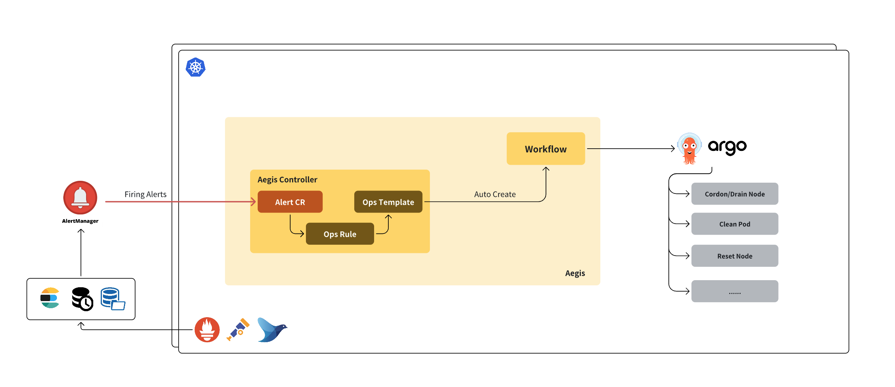

# Aegis - Cloud-Native AIOps Framework for Kubernetes

Aegis 是一个运行于 Kubernetes 平台上基于告警事件驱动的云原生自动化运维系统，旨在自动响应并处理集群中的各种异常状态，将告警与运维标准操作流程（SOP）衔接，显著提升运维效率与故障响应速度。通过自定义资源（CRD）与工作流引擎（如 Argo Workflows）集成，实现了从告警接收、规则匹配、自动渲染、执行运维工作流到状态反馈的完整闭环处理。除此之外还包括 AI-HPC 集群故障诊断和集群节点巡检功能。



# 目录

- [核心能力](#核心能力)
  - [集群自动化运维](#集群自动化运维)
  - [集群诊断（Experimental）](#集群诊断experimental)
  - [集群巡检（Experimental）](#集群巡检experimental)
- [构建并部署服务](#构建并部署服务)
- [构建镜像](#构建镜像)
- [部署服务](#部署服务)
- [配置告警源接入](#配置告警源接入)
  - [Alertmanager](#alertmanager)
  - [系统自定义风格](#系统自定义风格)
- [安装运维规则](#安装运维规则)
  - [制作 SOP](#制作-sop)
  - [制作运维规则](#制作运维规则)
  - [部署运维规则](#部署运维规则)
- [触发自动化运维](#触发自动化运维)
- [典型场景案例](#典型场景案例)

# 核心能力

## 集群自动化运维

通过定义以下数个 Kubernetes CRD：
- **AegisAlert**: 定义了告警资源，包含告警类型、状态和对象等。
- **AegisAlertOpsRule**: 定义告警工作流规则。一方面，包含对 `AegisAlert` 告警类型、状态和 Label 的匹配条件；另一方面，包含对 `AegisOpsTemplate` 索引。
- **AegisOpsTemplate**: 包含一个 Argo Workflow 执行模板。

Aegis 支持将告警源（现支持通过AI解析来自不同告警源的告警消息，例如AlertManger、Datadog、Zabbix等）的告警消息转换成 `AegisAlert` 资源，匹配对应的 `AegisAlertOpsRule` 规则并实例化 `AegisOpsTemplate` 模板，创建运维工作流。

- 告警统一接入：支持 AlertManager、默认数据源等，通过 webhook 接收告警。
- 事件驱动响应：告警被转化为 AegisAlert 对象驱动整个工作流。
- 自动化执行：结合 Argo Workflow 执行复杂的运维任务。
- 自定义运维规则与脚本：通过 AegisCli 管理规则、生成模板、构建镜像。
- 全生命周期管理：每条告警的处理进度可通过 CR 状态追踪。

## 集群诊断（Experimental）

通过 `AegisDiagnosis` CRD 标准化定义诊断对象，支持基于 LLM 的诊断总结。当前支持的诊断对象类型：

- [Node](docs/node-diagnosis_CN.md)

  > ⚠️ **在使用 Node 诊断功能前，请确保 Collector Pod 镜像已正确配置。Aegis 提供了默认镜像，但也支持通过 controller 启动参数指定自定义镜像。详见 [Collector Pod 使用指南](docs/node-diagnosis_CN.md#collector-pod-guide)。**
- [Pod](docs/pod-diagnosis_CN.md)
- [PytorchJob](docs/pytorchjob-diagnosis_CN.md) (as defined by [Kubeflow](https://www.kubeflow.org/docs/components/trainer/legacy-v1/user-guides/pytorch/))

待支持的诊断对象类型：

- Argo Workflow

> **附加能力：**
>
> * 🔁 *第三方系统集成：* 通过创建 `AegisDiagnosis` 自定义资源（CR），外部系统可以触发诊断任务。详见 [诊断集成指南](docs/diagnosis-integration-guide_CN.md)。
> * 🧠 *自定义大模型提示词支持：* 可通过配置 `ConfigMap` 来为不同类型的对象定制诊断提示词。详见 [自定义提示词指南](docs/diagnosis-custom-prompt-guide_CN.md)。

## 集群巡检（Experimental）

通过 `AegisNodeHealthCheck` 和 `AegisClusterHealthCheck` CRD 标准化定义节点巡检和集群巡检，支持提供自定义一系列巡检脚本，满足从 Pod 视角执行脚本从而巡检节点需求。

> 与 [node-problem-detector](https://github.com/kubernetes/node-problem-detector) 的区别：NPD 运行在宿主机上检查节点问题，但是一些场景（尤其是 AI HPC 场景）需要模拟实习生产环境并在 Pod 内执行巡检来做检查，NPD 无法适用。

# 构建并部署服务

# 构建镜像

```bash
docker build -t aegis:test -f Dockerfile .
```

# 部署服务

```bash
## 安装 CRD
kubectl apply -f manifest/install/

## 部署 Aegis Controller
kubectl apply -f manifest/deploy/ -n monitoring
```

# 配置告警源接入

当前支持三种风格的告警接入：

* `/ai/alert`：通过 [AIAlertParser](docs/ai-alert-parse_CN.md) 调用 LLM 自动解析各类告警消息，转化为统一的 AegisAlert 格式。
* `/alertmanager/alert`：支持标准的 `Alertmanager` HTTP POST 格式。
* `/alert`：支持自定义的 JSON 格式，方便三方系统主动触发告警。

## Alertmanager

按照 [Alertmanager](https://prometheus.io/docs/alerting/latest/alertmanager/) 官方文档，以下配置可以将告警信息全部发送给 `Aegis` 系统。

``` yaml
"global":
    "resolve_timeout": "5m"
"inhibit_rules":
- "equal":
    - "alertname"
    "source_matchers":
    - "severity = critical"
    "target_matchers":
    - "severity =~ warning"
"receivers":
- "name": "Aegis"
    "webhook_configs":
    - "url": "http://aegis.monitoring:8080/alertmanager/alert"
"route":
    "group_by":
    - "alertname"
    "group_interval": "5m"
    "group_wait": "0s"
    "receiver": "Aegis"
    "repeat_interval": "12h"
```

## 系统自定义风格

这是自定义风格的 golang 定义。

``` go
type Alert struct {
	AlertSourceType AlertSourceType
	Type            string              `json:"type"`
	Status          string              `json:"status"`
	InvolvedObject  AlertInvolvedObject `json:"involvedObject"`
	Details         map[string]string   `json:"details"`
	FingerPrint     string              `json:"fingerprint"`
}

type AlertInvolvedObject struct {
	Kind      string `json:"kind"`
	Name      string `json:"name"`
	Namespace string `json:"namespace"`
	Node      string `json:"node"`
}
```

可以使用 curl 来 Post 告警给系统。

```bash
curl http://aegis.monitoring:8080/default/alert -d '{
    "type": "NodeOutOfDiskSpace",
    "status": "Firing",
    "involvedObject": {
        "Kind": "Node",
        "Name": "node1"
    },
    "details": {
        "startAt": "2022021122",
        "node": "node1"
    },
    "fingerprint": "5f972974ccf1ee9b"
}'
```

# 安装运维规则

下面举一个简单例子：在节点出现 NodeHasEmergencyEvent 告警时候希望能触发 Cordon 节点操作。

## 制作 SOP

为实现意图，一般的 shell 脚本如下：

``` bash
kubectl cordon $node
```

## 制作运维规则

简单来说就是需要把 NodeHasEmergencyEvent 和 SOP 关联起来，并做到模板化。（需要 cordon 的节点目前是占位 {{.node}}，会在事件到达时刻提取具体节点做模版实例化）

``` yaml
---
apiVersion: aegis.io/v1alpha1
kind: AegisAlertOpsRule
metadata:
  name: nodehasemergencyevent
spec:
  alertConditions:
  - type: NodeHasEmergencyEvent
    status: Firing
  opsTemplate:
    kind: AegisOpsTemplate
    apiVersion: aegis.io/v1alpha1
    namespace: monitoring
    name: nodehasemergencyevent
---
apiVersion: aegis.io/v1alpha1
kind: AegisOpsTemplate
metadata:
  name: nodehasemergencyevent
spec:
  manifest: |
    apiVersion: argoproj.io/v1alpha1
    kind: Workflow
    spec:
      serviceAccountName: aegis-workflow
      ttlSecondsAfterFinished: 60
      entrypoint: start
      templates:
      - name: start
        retryStrategy:
          limit: 1
        container:
          image: bitnami/kubectl:latest
          command:
          - /bin/bash
          - -c
          - |
            kubectl cordon {{.node}}
```

## 部署运维规则

``` bash
# 部署
$ kubectl apply -f test.yaml 
aegisalertopsrule.aegis.io/nodehasemergencyevent created
aegisopstemplate.aegis.io/nodehasemergencyevent created

# 查看
$ kubectl get aegisalertopsrule
NAME                    STATUS
nodehasemergencyevent   Recorded

$ kubectl get aegisopstemplate
NAME                    STATUS     EXECUTESUCCEED   EXECUTEFAILED
nodehasemergencyevent   Recorded 
```

# 触发自动化运维

你可以通过手动 curl 模拟发送告警消息给 Aegis 系统从而触发自动化运维流程。

```bash
curl -X POST http://127.0.0.1:8080/default/alert -d '{
    "type": "NodeHasEmergencyEvent",
    "status": "Firing",
    "involvedObject": {
        "Kind": "Node",
        "Name": "dev1"
    },
    "details": {
        "startAt": "2022021122",
        "node": "dev1"
    },
    "fingerprint": "5f972974ccf1ee9b"
}'
```

可以通过 kubectl watch 看到 alert 的整个生命周期：

``` bash
$ kubectl -n monitoring get aegisalert --watch | grep default
default-nodehasemergencyevent-9njt4                NodeHasEmergencyEvent           Node         dev1     Firing     1                                   
default-nodehasemergencyevent-9njt4                NodeHasEmergencyEvent           Node         dev1     Firing     1       Triggered       Pending     0s
default-nodehasemergencyevent-9njt4                NodeHasEmergencyEvent           Node         dev1     Firing     1       Triggered       Running     0s
default-nodehasemergencyevent-9njt4                NodeHasEmergencyEvent           Node         dev1     Firing     1       Triggered       Succeeded   11s
```

可以查看背后的 Workflow 和执行日志。

``` bash
$ kubectl -n monitoring get workflow | grep default-nodehasemergencyevent-9njt4
default-nodehasemergencyevent-9njt4-s82rh            Succeeded   79s

$ kubectl -n monitoring get pods | grep default-nodehasemergencyevent-9njt4
default-nodehasemergencyevent-9njt4-s82rh-start-4152452869                    0/2     Completed   0               89s

$ kubectl -n monitoring logs default-nodehasemergencyevent-9njt4-s82rh-start-4152452869
node/dev1 cordoned
```

# 典型场景案例

- [内存压力自动 DropCache](examples/dropcache/README.md)
- [AI HPC 集群故障节点屏蔽与解除](examples/gpc/README.md)