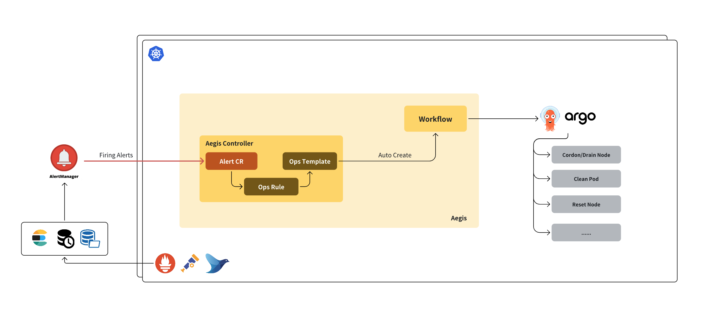

# Aegis - Cloud-Native AIOps Framework for Kubernetes

**📘 For the Chinese version, please refer to [README\_CN.md](./README_CN.md)**

# Table of Contents

* [Architecture](#architecture)
* [Core Capabilities](#core-capabilities)

  * [Automated Cluster Operations](#automated-cluster-operations)
  * [Cluster Diagnosis](#cluster-diagnosis)
  * [Cluster Health Check](#cluster-health-check)
  * [AI HPC Node Self-healing](#ai-hpc-node-self-healing)
* [Build and Deploy](#build-and-deploy)
* [Advanced Examples](#advanced-examples)


# Architecture

**Aegis** is a cloud-native, event-driven AI-powered operations platform for Kubernetes. It connects alert signals with intelligent diagnosis and standardized actions, enabling full-lifecycle automated self-healing. By integrating Kubernetes CRDs, Argo Workflows, and LLM-based analysis, Aegis improves operational efficiency and reduces response time.



Aegis defines three core CRDs:

* **AegisAlert**: Represents parsed alert events.
* **AegisAlertOpsRule**: Defines rule conditions and links alerts to operational workflows.
* **AegisOpsTemplate**: Contains Argo Workflow templates for execution.

Aegis supports multiple alert sources—including AlertManager, Datadog, Zabbix, and others—via both standard and LLM-based parsing. Alerts are transformed into `AegisAlert` CRs, matched by `OpsRule`, and executed via `OpsTemplate`.

🔗 See [Alert Source Integration Documentation](docs/ai-alert-parse.md) for supported formats and usage.

Key features:

* **Unified alert access** via webhook and AI-powered parsers.
* **Event-driven automation** through declarative CRDs.
* **Seamless workflow execution** with Argo integration.
* **Lifecycle visibility** via CRD status tracking.
* **Custom rules/scripts** managed through AegisCli.


# Core Capabilities

## Automated Cluster Operations

Aegis defines a standard workflow to automate Kubernetes operations:

* **Define SOP**: Write bash commands or script logic for operations.
* **Define OpsRule**: Describe when and how alerts should trigger automation.
* **Define OpsTemplate**: Render the SOP into an Argo Workflow template.
* **Trigger by Alert**: Automatically respond to alerts from Prometheus/Datadog/Zabbix/etc.

See: [Standard Automated Cluster Operations Workflow](docs/ops-workflow.md)

## Cluster Diagnosis

Aegis provides intelligent diagnosis for different object types using LLM prompts:

* [Node Diagnosis](docs/node-diagnosis.md)
* [Pod Diagnosis](docs/pod-diagnosis.md)
* [PytorchJob Diagnosis](docs/pytorchjob-diagnosis.md)

Each diagnosis type includes:

* CRD-based trigger (`AegisDiagnosis`)
* Multi-source log/metric collection via Collector Pod
* LLM-based summary explanation with optional custom prompt injection

Planned support:

* **Argo Workflow**

> **Additional Capabilities:**
>
> * 🔁 *Third-party systems integration:* Diagnoses can be triggered externally by creating `AegisDiagnosis` CRs. See the [Diagnosis Integration Guide](docs/diagnosis-integration-guide.md) for detailed instructions.
> * 🧠 *Custom LLM prompt support:* You can customize diagnosis prompts for different object types by configuring a `ConfigMap`. See the [Custom Prompt Guide](docs/diagnosis-custom-prompt-guide.md) to learn how.


## Cluster Health Checks (Experimental)

Supports standardized node and cluster inspection via `AegisNodeHealthCheck` and `AegisClusterHealthCheck` CRDs. Custom inspection scripts can be defined and executed from the Pod perspective for enhanced inspection flexibility.

> **Note:** Compared to [node-problem-detector (NPD)](https://github.com/kubernetes/node-problem-detector), Aegis supports inspections from within pods—useful in AI/HPC scenarios where simulated production environments are required.

## AI HPC Node Self-healing

Automatically detect and recover faulty nodes in AI/HPC environments, leveraging periodic inspection, anomaly detection, and SOP-based recovery.

See [Docs](docs/self-healing.md)


# Build and Deploy

## Build Image

```bash
docker build -t aegis:test -f Dockerfile .
```

## Deploy Aegis Services

```bash
kubectl apply -f manifest/install/
kubectl apply -f deploy/ -n monitoring
```


# Advanced Examples

Explore how Aegis is used in real scenarios:

* [Automatic DropCache under Memory Pressure](examples/dropcache/README.md)
  Use memory inspection + workflow to clear cache.

* [Isolation and Recovery of Faulty Nodes in AI HPC Clusters](examples/hpc/README.md)
  Automatically isolate and recover compute nodes in critical training jobs.