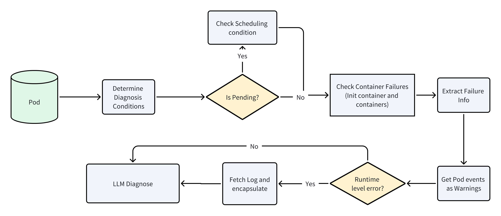

# 基于 AI 的 Pod 智能诊断

**基于 AI 的 Pod 智能诊断** 功能能够自动分析 Kubernetes Pod 的健康状态与运行情况，结合结构化 Prompt 模板，利用大语言模型（LLM）进行智能推理和故障诊断。

该功能通过整合失败信息、历史事件与运行时日志，帮助用户精准定位 Pod 故障根因并生成可操作的解决方案建议。

---

## 架构与诊断流程

整个诊断过程主要包括以下步骤：

### 1. 定位目标 Pod 对象

* 根据指定的命名空间（namespace）与名称（name）定位目标 `Pod`。
* 通过 Kubernetes API 获取该 Pod 对象并验证其存在性。

### 2. Pod 状态分析

诊断过程中提取以下三类信息：

#### **Failures（失败）**

在以下场景中提取失败信息：

* 若 Pod 处于 `Pending` 状态，且调度失败原因为 `Unschedulable`。
* 若任一 Init 容器（Init Container）启动失败。
* 若任一容器出现如下异常状态：

  * `CrashLoopBackOff`
  * `CreateContainerError`
  * Readiness 探针失败
  * 容器异常退出（ExitCode ≠ 0）

这些信息会被记录为诊断结果中的 `Failures`。

#### **Warnings（警告）**

* 系统会获取与该 Pod 相关的所有 `Event`（事件），来源包括 Prometheus 或 Kubernetes API。
* 所有事件将作为 `Warnings` 信息提供参考。

#### **Infos（信息）**

* 如果满足特定条件，系统会自动收集容器日志作为 `Info` 上下文，辅助分析运行时问题。

具体触发日志收集的逻辑由 `shouldFetchLog(pod)` 函数决定：

1. **容器非正常退出**

   * 如果任一 Init 容器或主容器的 `ExitCode` 不为 0。

2. **CrashLoopBackOff 状态**

   * 如果容器处于 `Waiting` 状态，且原因为 `CrashLoopBackOff`。

该逻辑确保仅在日志可能揭示问题根因时才进行收集，从而避免不必要的资源开销。

以下为 Pod 诊断流程示意图：



---

## AI Prompt 构造逻辑

完成数据采集后，系统会根据固定模板构造 Prompt，供大语言模型进行分析。模板如下：

```text
你是一个很有帮助的 Kubernetes 集群故障诊断专家，接下来你需要根据我给出的现象（如果没有有效信息，请直接返回正常）帮忙诊断问题，一定需要使用中文来回答.

异常信息: --- {{.ErrorInfo}} ---
一些 Pod 历史告警事件（如果认为有帮助，可以使用，或者忽略）： --- {{.EventInfo}} ---
一些 Pod 日志信息（如果认为有帮助，可以使用，或者忽略）： --- {{.LogInfo}} ---

请按以下格式给出回答，不超过 1000 字:

Healthy: {Yes 或者 No，代表是否有异常}
Error: {在这里解释错误}
Solution: {在这里给出分步骤的解决方案}
```

* `ErrorInfo`：提取的失败信息
* `EventInfo`：历史告警事件
* `LogInfo`：容器日志信息

Prompt 构造后由 LLM 推理，输出明确的异常解释与处理方案建议。

---

## 使用示例：诊断权限异常导致的 Pod 启动失败

本示例展示如何通过 `AegisDiagnosis` CR 对象诊断某个存在权限问题的 Pod。

### 第一步：应用诊断 CR 文件

```bash
kubectl apply -f diagnosis-pod.yaml
```

```yaml
# diagnosis-pod.yaml
apiVersion: aegis.io/v1alpha1
kind: AegisDiagnosis
metadata:
  name: diagnose-pod
  namespace: monitoring
spec:
  object:
    kind: Pod
    name: workflow-controller-xxxxx
    namespace: scitix-system
```

### 第二步：观察诊断执行过程

```bash
kubectl get -f diagnosis-pod.yaml --watch
```

当任务完成时，`PHASE` 字段应变为 `Completed`。

### 第三步：查看诊断结果

```bash
kubectl describe -n monitoring aegisdiagnosises.aegis.io diagnose-pod
```

### 示例输出

```
Status:
  Phase: Completed
  Explain: Healthy: No
  Error: 容器在启动时尝试注册对 ConfigMap 的监听器，但由于权限不足而失败。
         错误信息为："configmaps 'workflow-controller-configmap' is forbidden: User 'system:serviceaccount:...:argo' cannot get resource 'configmaps' in the namespace 'scitix-system'"

  Result:
    Failures:
      - the last termination reason is Error container=workflow-controller
    Infos:
      [pod logs]
      - ... Failed to register watch for controller config map ...
    Warnings:
      - BackOff restarting failed container (count 1930)
```

### AI 给出的处理建议

1. **检查 RBAC 权限配置**
   确认 ServiceAccount `argo` 是否有权限读取该命名空间下的 `ConfigMap`。使用以下命令查看：

   ```bash
   kubectl get rolebinding -n scitix-system
   kubectl get clusterrolebinding
   ```

2. **如无权限，创建 Role 与 RoleBinding**

   ```yaml
   apiVersion: rbac.authorization.k8s.io/v1
   kind: Role
   metadata:
     name: argo-configmaps-reader
     namespace: scitix-system
   rules:
   - apiGroups: [""]
     resources: ["configmaps"]
     verbs: ["get", "watch", "list"]
   ---
   apiVersion: rbac.authorization.k8s.io/v1
   kind: RoleBinding
   metadata:
     name: argo-configmaps-reader-binding
     namespace: scitix-system
   subjects:
   - kind: ServiceAccount
     name: argo
     namespace: scitix-system
   roleRef:
     kind: Role
     name: argo-configmaps-reader
     apiGroup: rbac.authorization.k8s.io
   ```

3. **重建 Pod**
   删除当前失败的 Pod，使其重新调度：

   ```bash
   kubectl delete pod workflow-controller-xxxxx -n scitix-system
   ```

4. **监控新 Pod 状态与日志**
   确保新 Pod 启动后，权限问题已解决。

