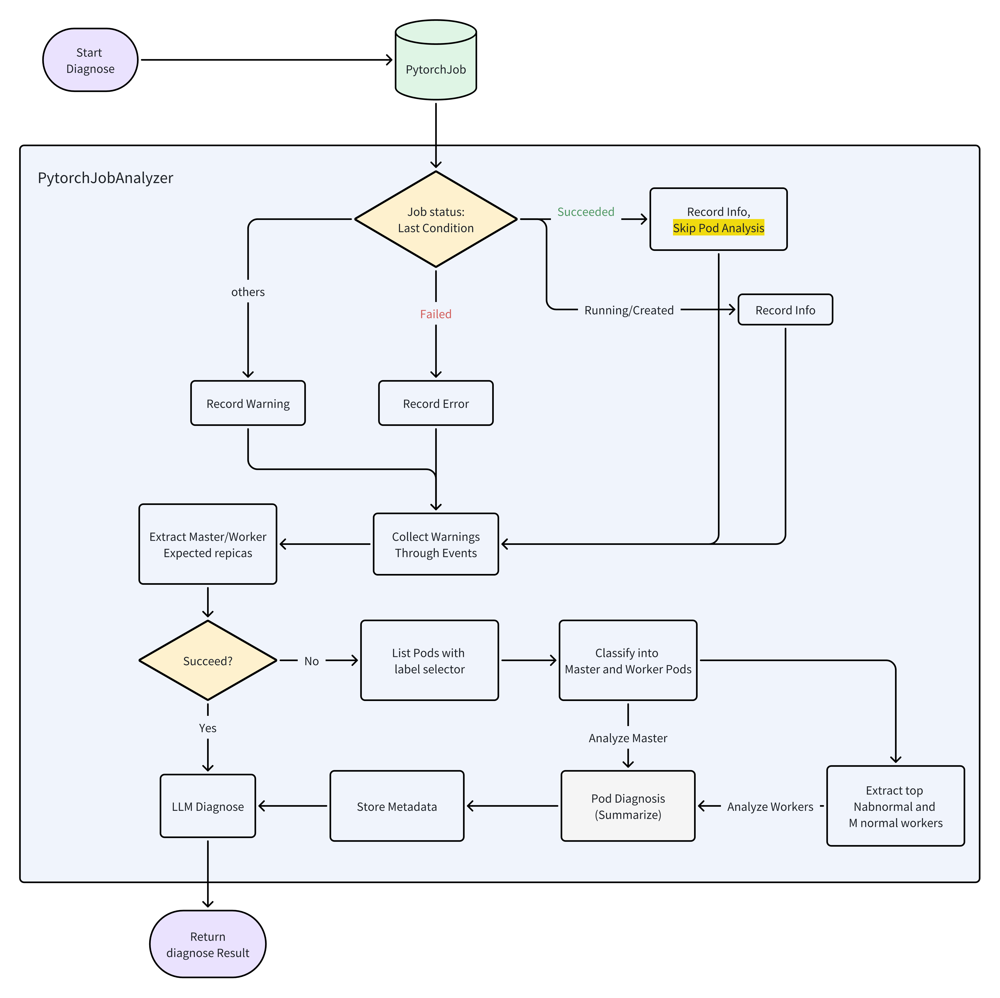

# PyTorchJob Diagnostic Feature


## Background

In Kubernetes-based machine learning platforms, **Kubeflow PyTorchJob** is widely used for managing distributed training tasks.
However, in real-world usage, PyTorchJobs often encounter various issues such as:

* Task failure (Failed status)
* Resource scheduling problems (Pending pods)
* Abnormal training behavior (OOM, loss=NaN, etc.)
* Inconsistent replica status

Automated diagnosis helps quickly identify and analyze the root cause of these issues, reducing manual troubleshooting effort.

---

## PyTorchJob Definition Example

```yaml
apiVersion: kubeflow.org/v1
kind: PyTorchJob
metadata:
  name: train-job
spec:
  pytorchReplicaSpecs:
    Master:
      replicas: 1
    Worker:
      replicas: 2
status:
  conditions:
    - type: Succeeded / Failed / Running
      reason: WorkerFailed / JobCancelled / JobSucceeded
      message: "worker-0 exited with code 137"
  replicaStatuses:
    Master:
      succeeded: 1
    Worker:
      failed: 1
```

---

## Diagnostic Process

**PyTorchJob diagnosis** follows a multi-level process:

1. **Resource definition layer** *(User responsibility)*
   Validate resource configuration (replica counts, affinity, tolerations, etc.).
   Note: This is typically a static check that relies on correct user configuration. The diagnosis tool does not perform a full static validation, but incorrect resource definitions may cause subsequent issues.
2. **Control layer (Job status and pod status)**
   Analyze `PyTorchJob.status` and pod-level status (`Pending`, `Running`, `Failed`, `Succeeded`).
   This layer helps detect issues such as pods not being scheduled or replicas failing to start.
3. **Execution layer (Pod logs)**
   Use LLM-based analysis to interpret pod logs and related Kubernetes events, identifying common training errors such as OOM, NaN loss, or missing packages.

The detailed process is illustrated in the figure below:



---

## Example Use Case: PyTorchJob Diagnosis with Custom Prompt

This is an example of running a diagnosis on a PyTorchJob using a **custom prompt template**.

* 📄 Custom prompt is defined in [`deploy/prompt-config.yaml`](../deploy/prompt-config.yaml)
* 📄 Diagnosis CR is defined in [`examples/diagnosis/pytorchjob/diagnosis-pytorchjob.yaml`](../examples/diagnosis/pytorchjob/diagnosis-pytorchjob.yaml)

To run the diagnosis:

```bash
kubectl apply -f examples/diagnosis/pytorchjob/diagnosis-pytorchjob.yaml
kubectl get aegisdiagnosises.aegis.io -n monitoring --watch
```

Once completed, you can view the result:

```bash
kubectl describe -n monitoring aegisdiagnosises.aegis.io pytorchjob-test
```

✅ This demonstrates how to override the default system prompt using a custom template via ConfigMap.

💡 Even without a custom prompt, Aegis will still work with its **built-in default prompt** for each supported diagnosis type.


---

## Custom Prompt Support

Users can **customize the diagnosis prompt** to control how the analysis result is structured and phrased.

### Available Variables and Usage in Templates

In your prompt template, you can reference variables using the following syntax:

```gotemplate
{{ index .Metadata "JobName" }}
```

### `.Metadata` Fields

These fields describe the basic information and replica status of a PyTorchJob:

* `{{ index .Metadata "JobName" }}` — Job name
* `{{ index .Metadata "JobStatus" }}` — Job status (e.g., Succeeded / Failed / Running / Created)
* `{{ index .Metadata "LauncherStatus" }}` — Status of the launcher replica
* `{{ index .Metadata "MasterExpected" }}` — Expected number of Master replicas
* `{{ index .Metadata "MasterCreatedCount" }}` — Actually created Master replicas
* `{{ index .Metadata "WorkerExpected" }}` — Expected number of Worker replicas
* `{{ index .Metadata "WorkerCreatedCount" }}` — Actually created Worker replicas
* `{{ index .Metadata "MasterDiagnosis" }}` — Summary diagnosis for Master Pod
* `{{ index .Metadata "WorkerDiagnosis" }}` — Summary diagnosis for Worker Pods

### Other Fields

These fields provide additional information extracted during the diagnosis:

* `{{ .ErrorInfo }}` — Extracted error information
* `{{ .EventInfo }}` — Related Kubernetes events
* `{{ .LogInfo }}` — Relevant logs from related pods

➡️ For full instructions on using custom prompts, see the [Custom Prompt Guide](./diagnosis-custom-prompt-guide.md).

---

## Result Format

The diagnosis output follows a structured format:

```
Healthy: {Yes / No}
Error: {One-line summary of the likely cause}
Analysis: {Concise analysis of the root cause, using Job / pod status, events, logs}
Solution: {Step-by-step actionable recommendations}
```

<!-- ---

## Prompt Template Versioning

When maintaining multiple custom prompts, we recommend adopting a simple versioning strategy to avoid conflicts and unexpected changes in production environments.

Recommended practices:

* Use filename suffix for versioning: `pytorchjob-v1.tmpl`, `pytorchjob-v2.tmpl`, etc.
* Maintain version history in Git to allow rollbacks if needed.
* Clearly document which prompt version is used in each environment (e.g. staging vs. production).
* When upgrading prompts, validate them in a non-production environment before rollout.

Following this practice ensures your LLM-based diagnostic experience remains **stable and predictable** across deployments. -->

